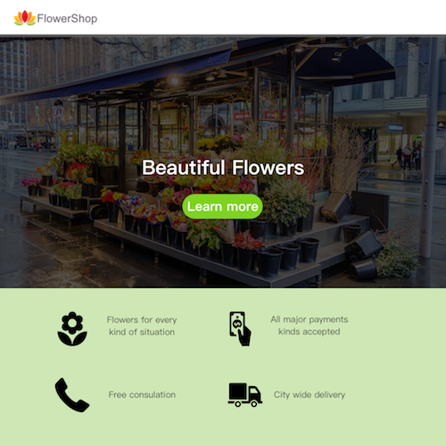

# Full Stack Software Engineering: Web Development Day 2 :rocket:

### Main Topics :zap:

- HTML Tags
- CSS Manipulation
- Javascript Basics

### Directions :flashlight:

- Go to the LMS and follow the exercises:
  [Day 2](https://xccelerate.talentlms.com/unit/view/id:2572)

### How it works :open_book:

- [ ] Clone this repository, open the files and fill them out according to the directions

Method one:

- Opening index.html from file explorer:
  - Right click on index.html
  - Hover over "Open with..."
  - Select your code editor (to change code) OR chrome (to see it)
  - Whenever you change your code, make sure to refresh the chrome page

Method Two:

- Opening index.html from VS code:

  - Follow method one and open your file within VS code
  - Install the extension Live Server
  - Right click on the index.html and then select open with Live Server, when you are finished, click the close server button on the bottom right of VS code.

  

## Exercises Due

- [ ] Exercise A: Create and link two pages (index.html and about.html)

  - [ ] index.html, through an image, links to about.html document
  - [ ] about.html has a link that opens the users mail system, to send an email

- [ ] Exercise B: Floating Three Divs, recreate the image below using HTML and CSS, use css float.

  

* [ ] Exercise C: Flex Box Three Divs, recreate the image from the last exercise, use HTML and CSS, use css flex

* [ ] Exercise D: Flowerbox VI - recreate the site using HTML and CSS, refer to the image below

  

- [ ] Finish the 'What is one thing that I learned from doing this project?' in the readme
- Bonus

- [ ] Exercise E: Flowerbox VII: Add @media queries such that your page is styled appropriately for mobiles, change your CSS file.

### Tips :tipping_hand_woman:

- We highly encourage you to follow practice the exercises; reading about code is not always enough, sometimes it's also important to practice implementing the specific steps. Don't worry if it feels difficult - that's normal. The important thing is to keep going, even when it feels hard :relaxed:

- If you get stuck, try to break down the problem. What small thing can you figure out first? Remember, instructors have a no touching your key board rule (we can help guide you, but won't debug for you!). Part of being a software engineer IS solving problems. It's a marathon, not a sprint :running_woman:

- Other debugging tips
  - [ ] Write down the logic of your code
  - [ ] Re-read documentation
  - [ ] Look at example code on github
  - [ ] Go slow. Do one thing at a time. You got this :muscle:

## What is one thing that I learned from doing this project? :books:
- Revised basic Gridterminologies and float concepts
- How to make a pill-shaped button
(Fill whatever you would like here!)
